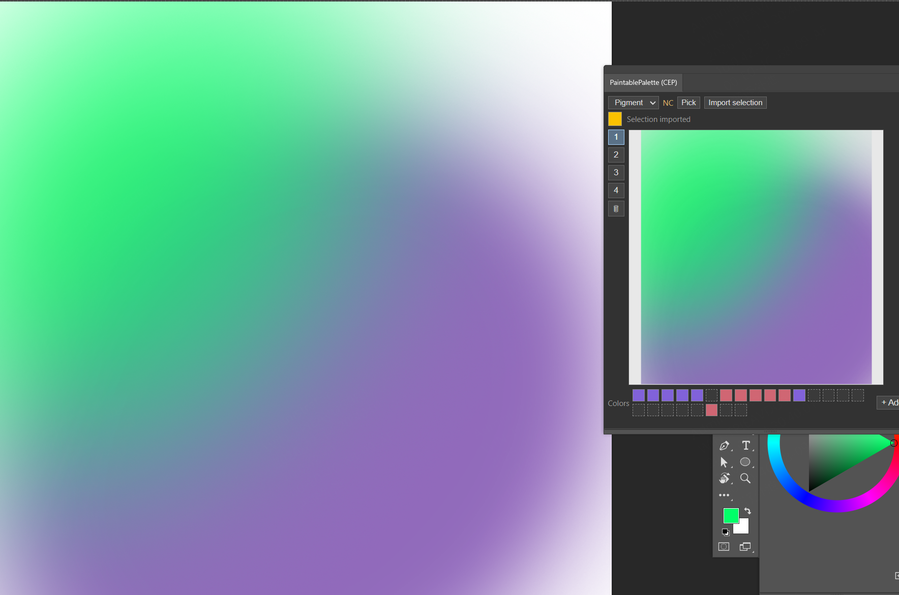

# Paintable Palette 自定义改动说明

本仓库基于 `jinshihui/Paintable-Palette-PS` Fork 修改，用于 Photoshop CEP 面板。

上图展示了将 Photoshop 当前图层选区导入调色纸后的效果，以及调色纸切换、颜料混色与常用颜色盒的位置。

## 新增功能

- 四张独立、自动保存的调色纸：通过左侧 `1–4` 按钮切换。
- 调色纸删除按钮：清空当前调色纸，不影响其他调色纸。
- 选区导入：在 Photoshop 中选中区域后，点击 `Import selection`，把当前活动图层的选区按比例导入当前调色纸。
- 24 格常用颜色盒：
  - `+ Add`：把当前 Photoshop 前景色存入第一个空格；
  - `Edit`：进入编辑模式；可拖动颜色调整位置，点 `×` 删除；
  - 针对窄面板支持自动换行，操作按钮不会被颜色格挤出面板。
- 持久化存储：调色纸、当前页面、混色模式与常用颜色均会保留。

## 混色模式

- `Pigment`（默认）：使用 Mixbox 2.0 的颜料混色，能获得更自然的色相过渡和二次色。
- `RGB`：保留普通 RGB 叠加模式，便于对比与兼容既有使用习惯。

## 许可说明

本修改版内置 Mixbox 2.0，因此**仅限非商业用途**。Mixbox 以 CC BY-NC 4.0 授权；其许可证全文位于根目录与扩展目录内的 `MIXBOX-LICENSE.txt`。如需商业使用，应联系 Mixbox 作者取得商业授权。

## 当前限制

- 插件可读取 Photoshop 当前前景色，但无法复刻 Photoshop 当前笔刷的笔尖、压感、纹理及流量。
- 选区导入只读取当前活动图层；没有有效选区或该图层在选区内没有可见像素时会提示失败。
